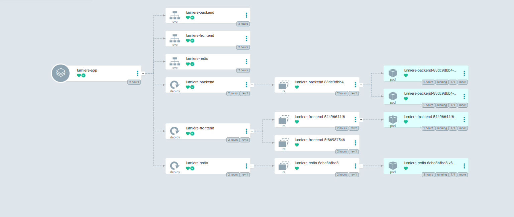

# Lumiere: Scalable Movie Recommendation System

[](https://www.python.org/downloads/)
[](https://fastapi.tiangolo.com/)
[](https://streamlit.io/)
[](https://www.docker.com/)
[](https://kubernetes.io/)
[](https://helm.sh/)
[](https://argoproj.github.io/cd/)
[](https://redis.io/)

## Overview
Lumiere is a production-ready, machine learning-powered movie recommendation system. Built with a focus on modern MLOps practices, it delivers fast and reliable recommendations through a microservices architecture. The system is fully containerized, orchestrated via Kubernetes, and managed through declarative GitOps workflows using ArgoCD to ensure zero-downtime deployments and self-healing infrastructure.

## Key Features
* **Microservices Architecture:** Decoupled frontend (Streamlit) and backend (FastAPI) services for independent scaling.
* **High-Performance Inference:** ONNX runtime integration for optimized machine learning model predictions.
* **In-Memory Caching:** Redis integration to cache frequent requests, significantly reducing latency.
* **GitOps Deployment:** Automated, state-reconciling continuous delivery pipeline managed by ArgoCD.
* **Infrastructure as Code (IaC):** Complete Helm chart implementations for reproducible cluster deployments.

## Repository Struture
```text
lumiere/
├── data/                  # Raw and processed datasets
├── docker/                # Dockerfiles for frontend and backend services
├── docs/                  # Architectural diagrams and stability proofs
├── helm/lumiere/          # Kubernetes manifests and Helm charts
├── models/                # Serialized ONNX machine learning models
├── src/                   # Source code (API, Data Processing, Frontend)
├── tests/                 # Unit and integration tests
├── Makefile               # Task automation commands
└── pyproject.toml         # Python dependencies and project configuration
```

## Application in Action

To provide a quick overview of the user experience and the recommendations, here is a visualization of the running Streamlit interface.

<p align="center">
  
</p>

## Architecture and Deployment Workflow

Lumiere is designed with high availability and scalability in mind. The system follows a microservices pattern where the frontend, backend, and cache (Redis) communicate seamlessly within a single Kubernetes namespace.

### GitOps and Infrastructure Stability

Deployment and state reconciliation are managed by ArgoCD via GitOps. A commit to the repository automatically triggers a declarative update of the Kubernetes resources via Helm. 

The image below demonstrates the live ArgoCD dashboard, showcasing our Zero-Downtime deployment architecture, the dynamic routing of services, and the self-healing nature of the pods over a sustained period.

<p align="center">
  
</p>